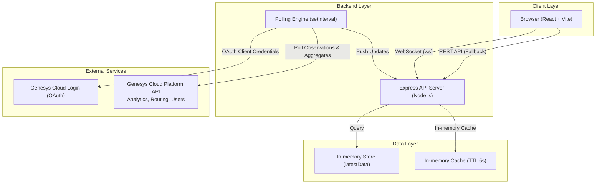
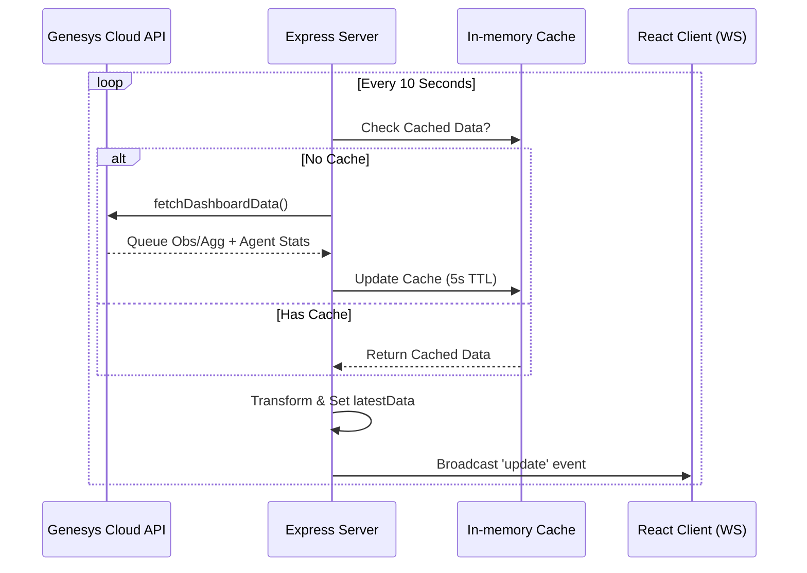

# Genesys Cloud 실시간 운영 대시보드 마스터 사양서

본 문서는 Genesys Cloud API를 연동하여 콜센터의 큐(Queue) 상태와 상담원(Agent) 현황을 실시간으로 모니터링하는 대시보드 시스템의 기술 사양을 기술합니다.

---

## 1. 전체 아키텍처



---

## 2. Genesys Cloud API 연동 구조

### 2.1 인증 및 권한 설계

- **OAuth Client Credentials**: 서버 간 통신을 위해 사용됩니다. [.env](file:///c:/Users/user/.antigravity/genesys-dashboard/.env)의 `GENESYS_CLIENT_ID` 및 `SECRET`을 통해 Access Token을 획득하며, 토큰 만료 시 자동 갱신됩니다.
- **API Scopes**: Analytics 쿼리 및 Routing/User 정보 조회를 위한 권한이 필요합니다.

### 2.2 실시간 데이터 연동 프로세스 (Sync Engine)

시스템은 별도의 DB 없이 실시간 API 호출과 WebSocket 전송을 기반으로 동작합니다.



---

## 3. 데이터 및 실시간 통신 설계

### 3.1 실시간 통신 (WebSocket)

- **경로**: `ws://localhost:3001/ws`
- **프로토콜**: [update](file:///c:/Users/user/.antigravity/it-asset-management/backend/src/assets/assets.controller.ts#39-42) 이벤트를 통해 최신 큐 정보, 상담원 리스트, 알림(Alert) 정보를 JSON 형태로 브로드캐스트합니다.
- **연결 관리**: 클라이언트 접속 시 가장 최근에 수집된 데이터를 즉시 전송하여 초기 로딩 지연을 최소화합니다.

### 3.2 데이터 가공 및 필터링

- **Queue Filter**: [.env](file:///c:/Users/user/.antigravity/genesys-dashboard/.env)에 설정된 `QUEUE_IDS`에 해당하는 큐만 집계합니다.
- **Agent Filter**: 정해진 7명의 상담원(Winnie, Mason 등) 화이트리스트를 기준으로 상태를 필터링하고 정렬합니다.
- **Aggregates**: 오늘 하루의 총 인입(Offered), 응답(Answered), 포기(Abandon) 건수를 Analytics API로 집계하여 응답률을 계산합니다.

---

## 4. API 명세 (주요 엔드포인트)

### 4.1 REST API

- `GET /api/dashboard/queues`: 현재 대시보드의 전체 데이터 스냅샷 (초기 로딩용).
- `GET /api/health`: 서버 상태, 마지막 업데이트 시각, 연결된 클라이언트 수 확인.

### 4.2 WebSocket Events

- **S -> Project: [update](file:///c:/Users/user/.antigravity/it-asset-management/backend/src/assets/assets.controller.ts#39-42)**:
  - `queues`: 각 큐의 대기호, 통화중, 상담원 수, 최장 대기 시간 등.
  - `agents`: 상담원 명단, 현재 상태(대화 가능, 유휴, 상담 중), 상태 유지 기간.
  - `alerts`: 대기호가 임계치(`ALERT_THRESHOLD`)를 초과한 큐 목록.

---

## 5. UI 와이어프레임 (Dashboard Layout)

### 5.1 상단 KPI 섹션 (Header & Metrics)

```
┌──────────────────────────────────────────────────────────┐
│  Title: 광고_사업팀 운영 대시보드 | Last Sync: 2s ago [OK]  │
├─────────────┬─────────────┬─────────────┬────────────────┤
│   응답률 (%)  │   대기호 (건)  │   포기호 (건)  │  응답/인입 (오늘) │
│    92.5%    │      2      │      3      │     142/154    │
└─────────────┴─────────────┴─────────────┴────────────────┘
```

### 5.2 메인 모니터링 섹션 (Queues & Agents)

- **Left (Queues)**: 각 큐별 상세 현황 카드 (상담중/상담가능 상세 분리).
- **Right (Agents)**: 상태별(Available > Idle > Interacting) 정렬된 실시간 상담원 리스트.
- **Alert Banner**: 대기호 증가 시 상단에 선명한 오렌지/레드 알림 배너 노출.

---

## 6. 프로젝트 구조 (Directory Tree)

```
genesys-dashboard/
├── client/                      # React (Vite) Frontend
│   ├── src/
│   │   ├── components/          # Header, KpiCard, AgentTable, QueueCard
│   │   ├── hooks/               # useWebSocket (Real-time hook)
│   │   └── App.jsx              # Main Dashboard Component
├── server/                      # Node.js (Express) Backend
│   ├── genesysApi.js            # API Data Transformation 로직
│   ├── genesysAuth.js           # OAuth Client Credentials 인증
│   ├── cache.js                 # 5s TTL In-memory Cache
│   └── index.js                 # Express + WS Server Entry
└── .env                         # Genesys Credentials & Target Queue IDs
```

---

*작성일: 2026-03-25*
*최종 업데이트: v0.1 Standard Specification*
